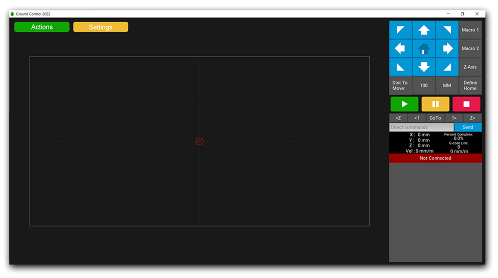

# Ground Control 2022

Ground Control is the program which allows you to control the Maslow CNC machine.

======================

## Overview

Ground Control is the program which allows you to control the [Maslow CNC machine](https://www.eastbaysource.com).

From within [Ground Control] (https://www.eastbaysource.com/index.php/user-guide/ground-control), you can move the machine to where you want to begin a cut, calibrate the machine, open and run a g-code file, or monitor the progress of an ongoing cut.

At present, the UI looks like this:

Ground Control is written in [Python](https://www.python.org/). It was chosen because it has good cross platform support and is relatively simple to work with.

----
## Installation

For Windows and OS X binaries, see the [releases](https://www.eastbaysource.com/index.php/downloads/category/5-software-and-firmware) page.

## Development Setup

Python 3.9.x

Kivy 2.0 framework

Pyserial

